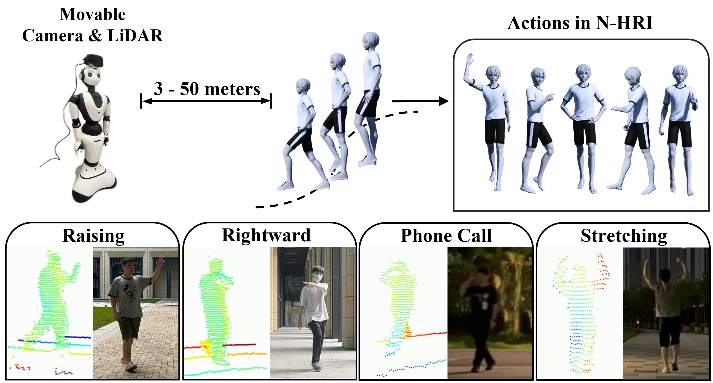

# ACTIVE: Action from Robotic View 🤖
### [➡️ download the dataset from Hugging Face ⬅️](https://huggingface.co/datasets/ACTIVE2750/ACTIVE)

This repository contains the official PyTorch implementation and dataset for our paper: **"Recognizing Actions from Robotic View for Natural Human-Robot Interaction"**, accepted at ICCV 2025.



-----

## 📜 About The Project

Natural Human-Robot Interaction (N-HRI) requires robots to recognize human actions at varying distances and states, regardless of whether the robot itself is in motion or stationary. This setup is more flexible and practical than conventional human action recognition tasks. However, existing benchmarks designed for traditional action recognition fail to address the unique complexities in N-HRI due to limited data, modalities, task categories, and diversity of subjects and environments. To address these challenges, we introduce ACTIVE (Action from Robotic View), a large-scale dataset tailored specifically for perception-centric robotic views prevalent in mobile service robots. ACTIVE comprises 30 composite action categories, 80 participants, and 46,868 annotated video instances, covering both RGB and point cloud modalities. Participants performed various human actions in diverse environments at distances ranging from 3m to 50m, while the camera platform was also mobile, simulating real-world scenarios of robot perception with varying camera heights due to uneven ground. This comprehensive and challenging benchmark aims to advance action and attribute recognition research in N-HRI. Furthermore, we propose ACTIVE-PC, a method that accurately perceives human actions at long distances using Multilevel Neighborhood Sampling, Layered Recognizers, Elastic Ellipse Query, and precise decoupling of kinematic interference from human actions. Experimental results demonstrate the effectiveness of ACTIVE-PC.

-----

## 🚀 Getting Started

Follow these steps to set up the environment and run our code.

### Prerequisites

  * Python 3.8+
  * PyTorch 1.12.0+
  * CUDA 11.3+

### Installation

1.  **Clone the repository:**

    ```bash
    git clone https://github.com/your-username/ACTIVE.git
    cd ACTIVE
    ```

2.  **Create a virtual environment and install dependencies:**

    ```bash
    # We recommend using conda or venv
    pip install -r requirements.txt
    ```

3.  **Compile custom CUDA operators:**
    Our model requires custom CUDA extensions for efficient point cloud processing.

      * **PointNet++ Layers:**
        ```bash
        cd modules/
        python setup.py install
        cd ..
        ```
      * **k-Nearest Neighbors (kNN):**
        ```bash
        pip install --upgrade https://github.com/unlimblue/KNN_CUDA/releases/download/0.2/KNN_CUDA-0.2-py3-none-any.whl
        ```

For a detailed environment specification, please see the `requirements.yml` file.

-----

## 📊 Dataset

The **ACTIVE** dataset is a core contribution of this work. To download it, please visit our [official project page](https://www.google.com/search?q=https://your-project-page-url) and follow the instructions to request access.

Once downloaded, place the dataset in a `data/` directory or update the data path in the configuration files.

-----

## ⚡️ Usage

### Training

To train the **ACTIVE-PC** model on the ACTIVE dataset, run the following command. Ensure the dataset path and configuration file are set correctly.

```bash
# Example training command
python train.py --config cfgs/active_pc_config.yaml --data_path /path/to/your/active_dataset
```

### Evaluation

To evaluate a pre-trained model, specify the path to your model checkpoint (`.pth` file).

```bash
# Example evaluation command
python test.py --config cfgs/active_pc_config.yaml --data_path /path/to/your/active_dataset --checkpoint /path/to/your/model.pth
```

-----

## 🙏 Acknowledgements

This work is built upon the foundational codebase of [PSTNet](https://github.com/hehefan/Point-Spatio-Temporal-Convolution).

-----

## ✍️ Citation

If you use our dataset or model in your research, please consider citing our paper:

```bibtex
Coming soon.
```